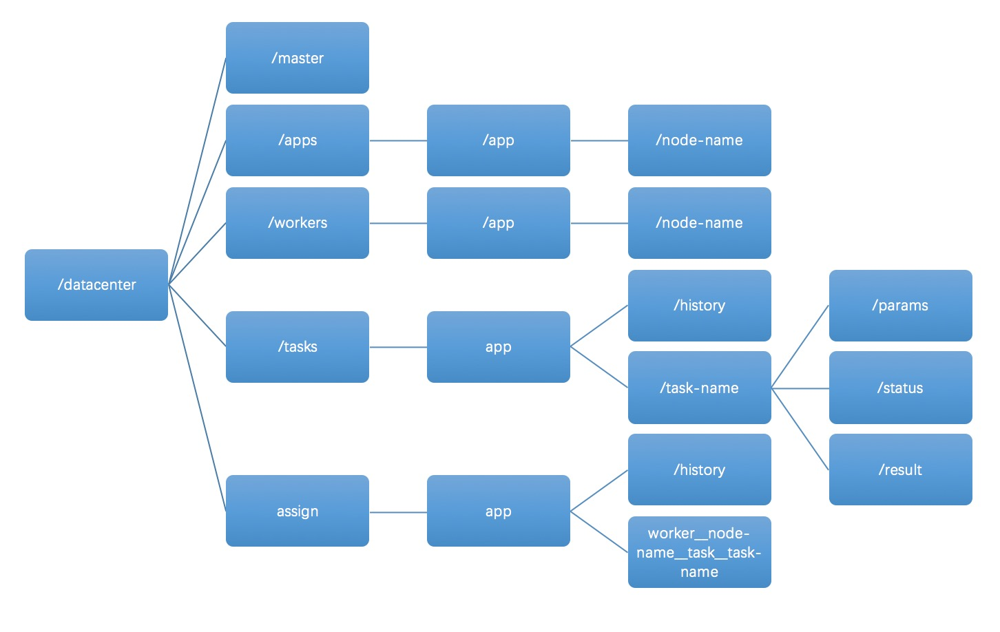
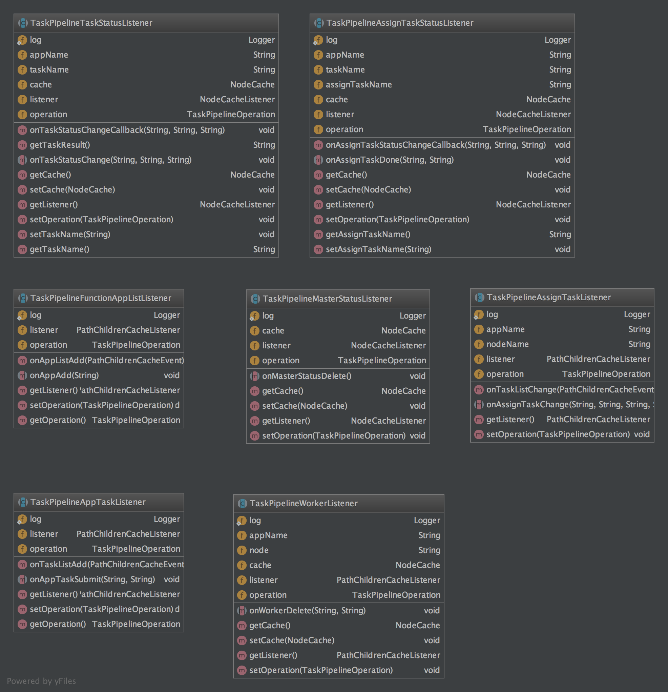

title: zk分布式任务队列交互设计
author: Sean
tags:
  - zookeeper
  - 分布式
  - 队列
categories:
  - 设计
date: 2018-07-22 23:12:00
---
### 背景
近来公司业务上越来越多的跨进程比较耗时计算的场景出现，想用异步通信来解决长时间资源占用及等待问题，而基于多方的探讨，不考虑采用_mina_和_netty_这种异步通信的框架，最后决定使用**zookeeper**来实现

### 目的
异步进行耗时较长的复杂计算请求，可随时获取请求执行进度

### 实现思路
* 将这种请求的发起者当作是请求任务的生产者，每个请求其实就是一个计算任务。
* 后端接收请求的服务就是消费者，获得请求之后进行计算，并更新计算进度。
* 当任务完成时，请求发起者可以通过监听任务状态回调实现自己的逻辑。
* 过程中，请求发起者也可以主动获取计算讲求的进度。

### 实现设计
基于实现思路，设计zk的path结构如下


*/master*  
为程序高可用实现预留路径  

*/apps*  
为业务连接节点，底下结构为/app/node，比如你有个业务叫a,有两个业务节点b1和b2，那就有/a/b1和/a/b2 路径。由业务节点启动时注册  

*/workers*  
底下结构逻辑与/apps一致，只不过节点为服务端的节点，由服务端节点启动时注册  

*/tasks*  
由业务提交注册的计算任务,以业务区分目录，以app-node-timestamp格式来命名taskid,每个节点拥有params,status和result三个节点  
* params 为请求参数，以文本格式存储，例如可以使用json格式传输
* status 为task状态，默认有submit,running,done,noworker（无计算服务）,missapp（app节点断线）,consumed（已消费），resubmit（重分配）几种状态，worker可以添加自定义中间过程状态，任务提交时默认为submit状态。
* result 为初始不存在，当status变更为done时添加，内容为文本格式，例如可以使用json，包括type和value,先只支持两种，第一种为直接返回为{"type":"content","value":"something"},考虑zk单个节点的容量问题，可能返回较大数据量，使用redis作为结果缓存层，返回{"type":"redis_key","value":"one redis key"} 当然不用redis也行，当数据量更大的时候可使用其它工具，这里先选用redis

history目录下为完成的任务，定时持久化清理。 

*/assign*  
由系统根据业务app分配作业给worker，以node-taskid来标识作业  
history目录下为执行完的作业，定时持久化清理

### 模块设计
1. 调度系统  
	实现基于zk的路径交互，负责与业务和服务两端交互
2. 业务端接口包封装  
	对于业务端来说，只需要提交服务端接口标识，接口参数之后返回taskId,根据需要通过taskId进行结果回调监听，支持查询task状态，需要屏蔽底层操作，透明化复杂操作。  
3. 服务端接口包封装  
	对于服务端来说，只需要继承某个类，声明服务标识，实现监听task队列的方法，处理被推送过来的任务，并根据需要更新自定义task状态，处理完成后在方法选择返回的内容类型即可  
  

### 流程设计
#### 正常交互流程  
(由于用的uml画图工具问题，画得不是很规范，见谅...)  
正常交互流程  

worker断线重新分配任务流程  

### 核心模块类图  
基本操作都抽象成名为operation的类，基于不同角色做扩展，目前情况如下

baseOperation为zk的基本操作，operation为倾向原子性业务操作，分角色扩展的operation如serverOperation为封装角色实现本身的组合操作  
监听器主要有以下监听器实现  

每个角色都是基于以上两个核心模块加以逻辑处理来实现自己的功能

### Task分发策略
worker每当被分发task，便权重添加1，处理完则减1  
分发Task时选择权重最小的节点  
若权重都一样，则随机一个节点